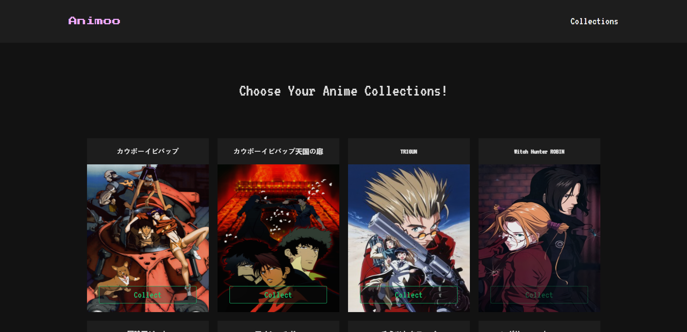

# Animoo (Anime Collections)

Anime collections. Tokopedia technical test project assignment.

## Screenshots

## Authors

- [@yuwanjoong_](https://www.instagram.com/yuwanjoong_/)

## Tech Stack

**Framework/Library:** ReactJS, GraphQL(Apollo Client), Emotion, Animate.css, React Spinner, and SweetAlert2.

## Features

- Dark UI design
- Mobile First and Single Page Application(SPA)
- Persisted collection data using Local Web Storage.
- Anime list
- Anime detail information
- Add anime to collection
- Anime collection list
- Remove anime from collection

## Author Message

It's not perfect but it's work!. This is the best that I've made in one week and I am proud of it. i added cool libraries, the detail, and kakoi UI design to get this website more interactive and fun to see. I know it's not satisfactory enough from a large company perspective but I learn a lot from this project. I willing to learn more about standard of how web development work flow in big companies like Tokopedia. I hope this project assignment will be my ticket to be a part of Tokopedia nakama journey in the future!. Thank you so much.    

